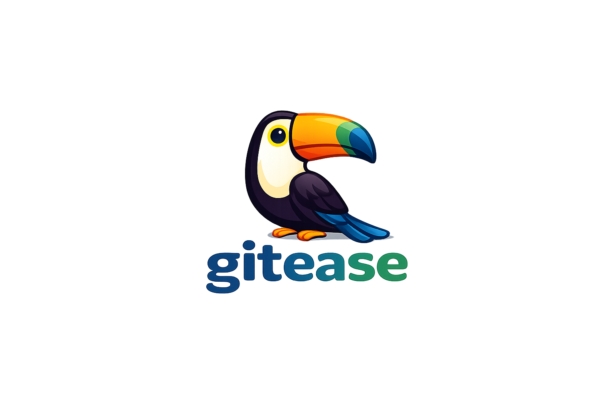

<div align="center">
    
</div>


A free, open-source, cross-platform Git repository manager built for speed and simplicity.

GitEase aims to make Git visual, fast, and accessible — without the bloat. Whether you're a beginner learning Git or a seasoned developer managing complex repos, GitEase gives you a clean interface to handle branches, commits, merges, and more.

## Tech Stack

| Layer | Technology | Why |
| --- | --- | --- |
| Framework | [Tauri](https://tauri.app/) | Lightweight, secure, native-feeling desktop apps |
| Frontend | [Svelte](https://svelte.dev/) + TypeScript | Compile-time reactivity, minimal runtime overhead |
| Styling | [shadcn-svelte](https://shadcn-svelte.com/) + Tailwind CSS | Customizable, accessible components |
| Backend | [Rust](https://www.rust-lang.org/) | Performance and memory safety |
| Git Engine | [git2-rs](https://github.com/rust-lang/git2-rs) (libgit2) | Battle-tested Git operations |
| Monorepo | [Turborepo](https://turbo.build/) + pnpm | Fast builds, clean workspace management |

## Architecture

```
Svelte UI → Tauri IPC → Rust Backend → git-core → libgit2
```

The project follows a monorepo structure:

```
gitease/
├── apps/                         # Runnable applications
│   └── desktop/                  # Tauri desktop application
│       ├── src-tauri/            # Rust backend (Tauri commands, state, IPC)
│       ├── frontend/             # Svelte frontend
│       │   ├── App.svelte        
│       │   ├── routes/           # App pages (repo view, settings, welcome)
│       │   ├── lib/              # Shared frontend logic
│       │   │   ├── components/   # Feature components (commit list, diff viewer)
│       │   │   ├── primitives/   # Base UI elements (buttons, modals, inputs)
│       │   │   ├── stores/       # Svelte stores for state management
│       │   │   └── utils/        # Helper functions, types, constants
│       │   └── assets/           # Static files (icons, fonts, images)
│       └── package.json
├── packages/                     # Shared libraries
│   └── git-core/                 # Rust crate for Git operations (libgit2)
├── agents/                       # Python LangGraph AI agents
└── .github/                      # CI/CD workflows and issue templates
```

- `apps/desktop/tauri` — The Tauri desktop application commands
- `apps/desktop/frontend` — Shared Svelte component library
- `packages/git-core` — Standalone Rust crate for Git operations

## Team

| Name | Role | GitHub |
| --- | --- | --- |
| Guilherme | Creator & Maintainer | [@guilhermedelrio](https://github.com/guilhermedelrio) |
| Paulo | Creator & Maintainer | [@paulonnn](https://github.com/paulonnn) |

## License

[MIT](https://www.notion.so/LICENSE)
